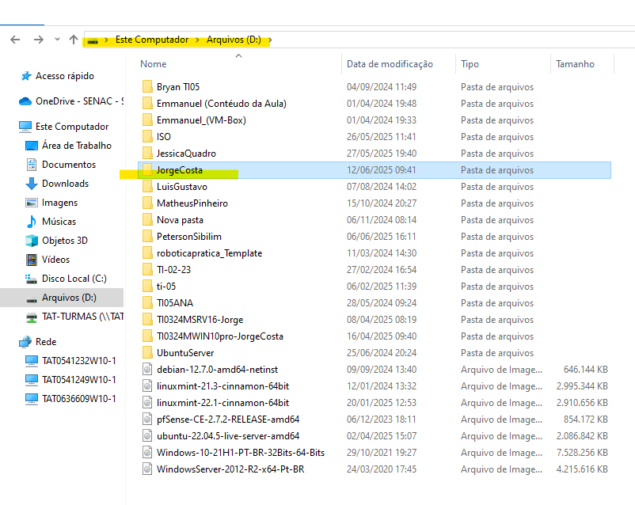
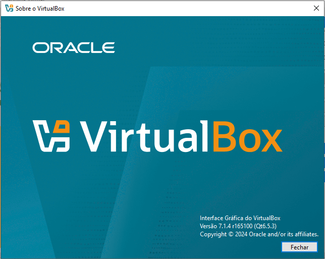
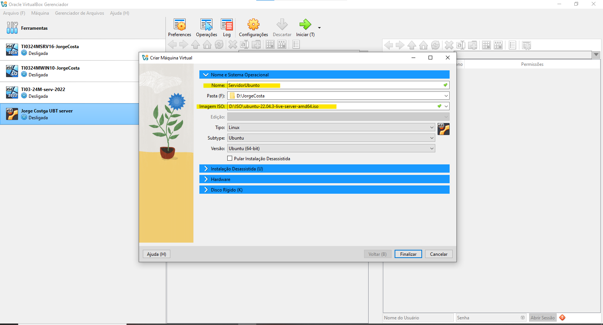
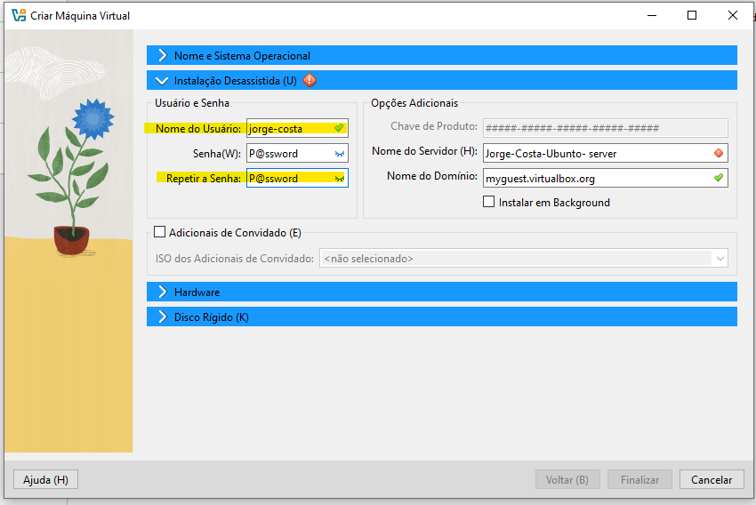
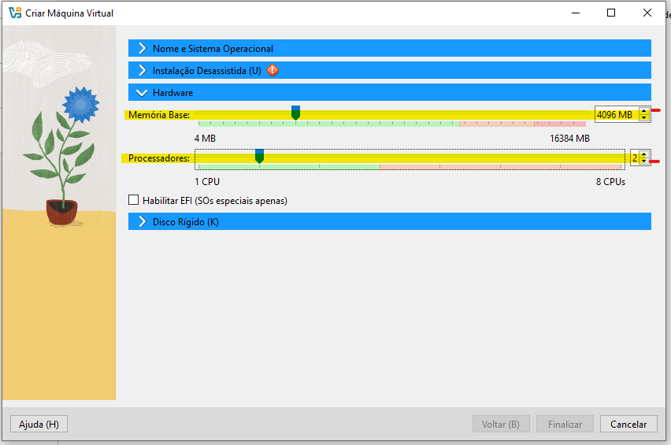
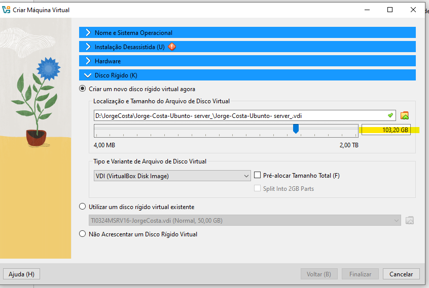
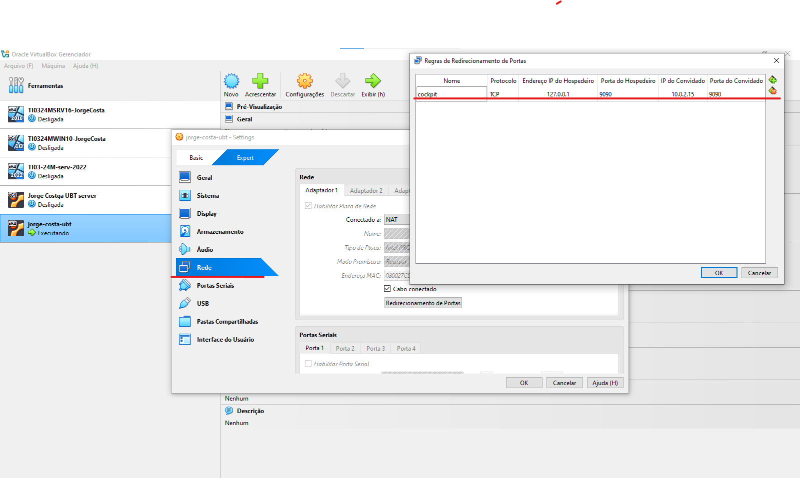
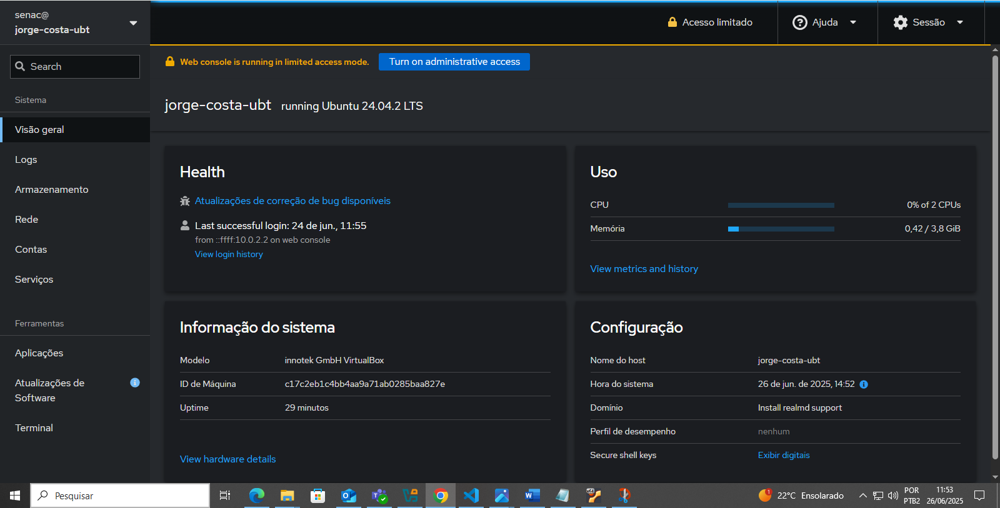

# Preparação de ambiente 
Criar uma máquina virtual para instalar as ferramentas e dependências para o estudo de algoritimos e lógica de programação

## Criar o diretório base 
Vamos criar um diretirio para guardar a nossa máquina virtual. Será criado no 
Drive D. Nomeada com o nome do usuario. 

## Preparação da máquina virtual 
### Vamos usar a ferramenta de virtualização chamada de Virtual Box 

<a href="https://www.virtualbox.org/wiki/Downloads"> Faça o Download aqui </a>

## Criando a máquina virtual 

## Configurações da máquina virtual 

Utilize a ISO Ubunto Server 22.04 

<a href="https://ubuntu.com/download/desktop"> Faça o Download aqui </a>  

Coloque seu nome de usuário e senha 

Para configurações de hardware coloque 4000 mb de memória base e 2 de processadores 

Para armazenamento de disco utilize a quantidade de 100 Gb.

## Aguarde a instalação 

### Seguindo a sequência da instalação 

Selecione a opção português caso deseje

Selecione português Brasil 

Selecione ubunto server

Aguarde a conclusão e selecione concluído 

Mantenha essa configuração e selecione concluído 

##Upgrade do sistema 

Selecione a opção Skip for now 

selecione concluído

selecione concluído

### configuração de usuario e senha

coloque seu usuario e senha

### Após todo o processo de instalação realize os updates. 

		
	#sudo apt update -y    sudo apt upgrade -y    reboot     

### Acessando a interface gráfica do sistema 

sudo apt install cockpit 

### Acesso ao Cockpit via Máquina Virtual (VM)
Para acessar o Cockpit em uma máquina virtual, siga os passos abaixo para configurar corretamente a porta de comunicação:

## Configure o redirecionamento de porta na VM:

Acesse as configurações de rede da sua máquina virtual.
Adicione uma nova regra de redirecionamento de porta (Port Forwarding).
Preencha os campos da seguinte forma:

Nome: Cockpit
Protocolo: TCP
Endereço IP do hospedeiro: 127.0.0.1 (loopback/localhost)
Porta do hospedeiro: 9090
Endereço IP do convidado: deixe em branco ou 127.0.0.1
Porta do convidado: 9090
Acesse o Cockpit no navegador:

Após iniciar a VM, abra o navegador no seu sistema hospedeiro e acesse:
https://127.0.0.1:9090
Ignore o aviso de certificado e faça login com o usuário da VM.

